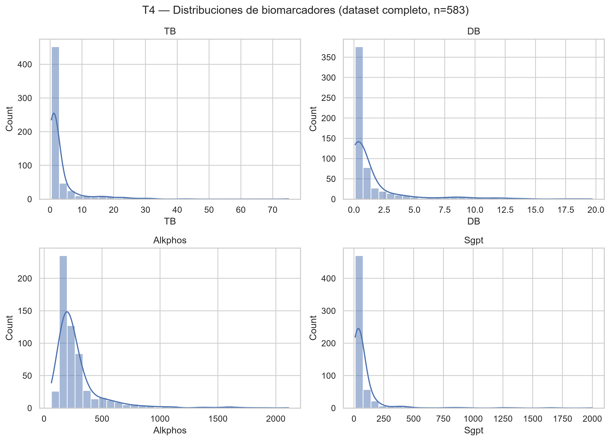
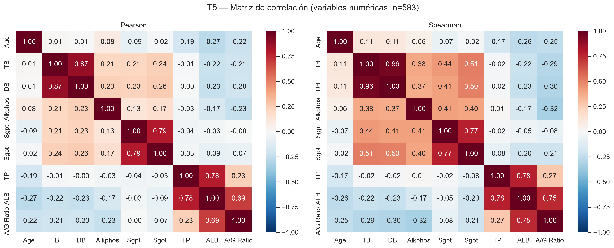
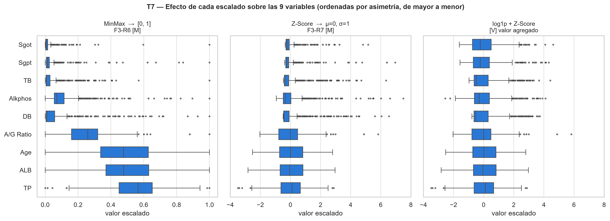
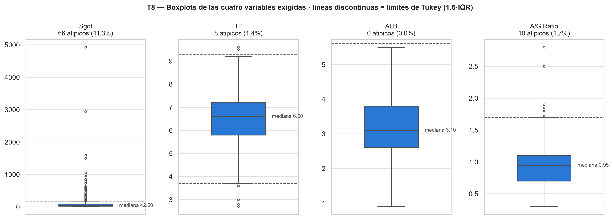
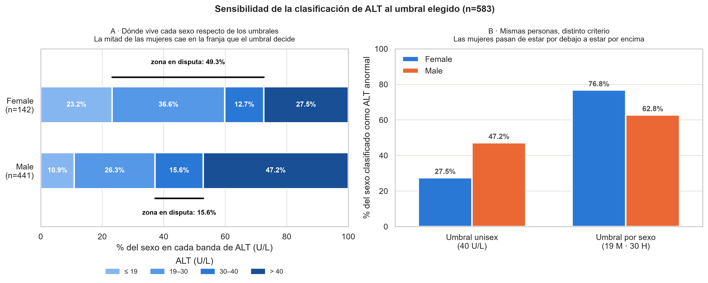

# Tratamiento de datos para la predicción de enfermedades hepáticas

**Actividad 1** · Análisis exploratorio y preparación del *Indian Liver Patient Dataset* (ILPD)

**Repositorio del proyecto:** https://github.com/hatlpm/liver-disease-fairness
*Notebooks ejecutables, decisiones de diseño documentadas y fuentes bibliográficas versionadas*

---

## 1. Introducción y contexto clínico

La enfermedad hepática crónica avanza durante años sin síntomas evidentes. Cuando aparecen los signos visibles —ictericia, ascitis— el daño suele ser ya avanzado e irreversible, por lo que el diagnóstico temprano depende casi por completo de un **panel de análisis de sangre**.

Este trabajo analiza el **ILPD**, 583 registros de pacientes del noreste de Andhra Pradesh (India), donado al repositorio UCI en 2012 por Ramana, Prasad Babu y Venkateswarlu (DOI 10.24432/C5D02C).

### 1.1 Qué miden las variables: los tres trabajos del hígado

Las nueve variables numéricas miden **tres funciones distintas**, y la dirección de la alarma no es la misma en las tres.

| Eje | Variables | Qué mide | Alarma |
|---|---|---|---|
| **Daño celular** | `Sgpt` (ALT), `Sgot` (AST) | Enzimas del interior de la célula hepática que se derraman a la sangre cuando esta se rompe. ALT es casi exclusiva del hígado; AST existe también en corazón y músculo | **Alto** |
| **Excreción biliar** | `TB`, `DB`, `Alkphos` (ALP) | Desechos que el hígado debería eliminar por la bilis, y la enzima de los conductos biliares. `DB` es la fracción de `TB` ya procesada | **Alto** |
| **Función sintética** | `TP`, `ALB`, `A/G Ratio` | Proteínas que el hígado fabrica. Al tener vida media larga, reflejan daño **crónico** | **Bajo** |

Esta agrupación no es decorativa: **explica la estructura de correlaciones (sección 6) y el patrón de asimetría (sección 5)** sin invocar hallazgos empíricos.

### 1.2 La variable objetivo

`Selector` codifica el diagnóstico: **1 = paciente hepático, 2 = no hepático**. Tres advertencias condicionan todo el análisis:

1. **No es verdad biológica, sino el juicio de un especialista** en un hospital concreto. Un modelo entrenado sobre ella no aprende *"quién tiene enfermedad hepática"* sino *"a quién le diagnosticaron enfermedad hepática ahí"*: es un ***proxy label*** y hereda los sesgos de ese sistema.
2. **No codifica ninguna enfermedad concreta.** El dataset no registra alcohol ni hepatitis viral, de modo que solo puede aprenderse la firma bioquímica del daño, nunca su causa.
3. **La codificación es contraintuitiva:** el valor 1 corresponde al caso positivo.

### 1.3 Alcance

Se cubren las ocho tareas del enunciado. **No se entrena ningún modelo ni se calculan métricas de clasificación.** El código que produce cada número está en `notebooks/act1_anexo.ipynb`; **ningún valor de este informe es estimado**.

---

## 2. Descripción del dataset (T1)

El archivo es un **CSV delimitado por comas** de **583 filas × 11 columnas**, con un consumo de memoria de ≈**76 KB**.

| Categoría | Cantidad | Variables |
|---|---|---|
| Numéricas | **9** | `Age`, `TB`, `DB`, `Alkphos`, `Sgpt`, `Sgot`, `TP`, `ALB`, `A/G Ratio` |
| Categórica | **1** | `Gender` (*Male* / *Female*) |
| Objetivo | **1** | `Selector` (1 / 2) |

Los tipos se reparten entre `int64` (`Age`, `Alkphos`, `Sgpt`, `Sgot`, `Selector`) y `float64` (`TB`, `DB`, `TP`, `ALB`, `A/G Ratio`), reflejando cómo reporta el laboratorio: enzimas en unidades enteras, concentraciones bioquímicas con decimales. No hay columnas de identificador ni de fecha, lo que impide cualquier análisis longitudinal.

**Composición:** 416 pacientes hepáticos y 167 no hepáticos; 441 hombres y 142 mujeres. Ambos desbalances se analizan en la sección siguiente. El significado clínico completo de cada variable, con unidades y rangos de referencia, está en `docs/data_dictionary.md`.

---

## 3. Problemas de calidad detectados (T2)

La auditoría identificó **nueve problemas**. Los seis primeros se detectan con inspección columna a columna; los tres últimos solo aparecen al cruzar variables o contrastar contra documentación externa.

| # | Problema | Valor |
|---|---|---|
| Q1 | Dimensiones | 583 × 11 |
| Q2 | Valores faltantes | **4**, todos en `A/G Ratio` (0.7%) |
| Q3 | Filas duplicadas exactas | **13** (570 únicas) |
| Q4 | Desbalance de clase | 416 / 167 ≈ **71 / 29** |
| Q5 | Desbalance de sexo | 441 / 142 ≈ **76 / 24** |
| Q6 | Codificación del objetivo | `Selector` ∈ {1, 2}, con **1 = enfermo** |
| Q7 | **Censura de la edad** | `Age = 90` significa **"≥ 90"** |
| Q8 | **Violación bioquímica** | **3 filas** con `DB > TB` |
| Q9 | **Age heaping** | Índice de Whipple **163.3** |

El desbalance de clase implica que la *accuracy* será engañosa en cualquier modelado futuro: un clasificador que respondiera "todos enfermos" acertaría el 71% sin aprender nada. El desbalance de sexo es la raíz técnica del sesgo documentado por Straw & Wu (2022), y se retoma en la sección 10.

> La ficha oficial de UCI declara **"Missing values: No"**, en contradicción con el archivo real. Se audita el dato, no la metadata.

### 3.1 Los tres problemas que requieren análisis

**Q7 — la edad máxima no es una edad.** La documentación de UCI establece que *"any patient whose age exceeded 89 is listed as being of age '90'"*. Hay **un solo paciente** con `Age = 90` y **ninguno entre 86 y 89**: es un tope administrativo por anonimización, de modo que el rango observado 4–90 **no es un rango real de edades**.

**Q8 — tres filas bioquímicamente imposibles.** La bilirrubina directa es una *fracción* de la total, de modo que `DB ≤ TB` se cumple por definición. Tres filas la violan: `TB`=1.8 con `DB`=9.0, `TB`=1.5 con `DB`=7.0 y `TB`=1.0 con `DB`=1.4. Son invisibles a un chequeo univariado —un `DB` de 9.0 es plausible **por sí solo**, dentro del rango de la columna— y el error solo existe **en relación con `TB`**. La bioquímica clínica atribuye esta discordancia a interferencia analítica, **nunca a fisiología real**.

**Q9 — las edades no se leyeron de un documento.** El índice de Whipple cuantifica el *age heaping*: la acumulación artificial de edades terminadas en 0 o 5 que ocurre cuando la edad se estima en lugar de verificarse. El valor obtenido, **163.3**, corresponde a la categoría **"Tosca"** de la escala de Naciones Unidas e indica un **63% más de personas en edades redondas** de las esperables. `Age` arrastra por tanto un error de ±2–3 años y no admite franjas etarias estrechas. *(El índice y su escala están diseñados para datos censales; aplicarlos a una cohorte hospitalaria, como aquí, no está validado en la literatura consultada — el valor numérico se verificó de forma independiente, pero la etiqueta cualitativa "Tosca" hereda un supuesto de dominio que no se comprobó. Ver `docs/data_dictionary.md`.)*

### 3.2 Decisión sobre los duplicados

Caben dos explicaciones —pacientes distintos con analítica idéntica, o error de captura— y el dataset no permite distinguirlas. Se midió el impacto antes de decidir:

| Métrica | Con duplicados (583) | Sin duplicados (570) |
|---|---|---|
| Media de `TB` | 3.299 | 3.322 (**+0.70%**) |
| Media de `DB` | 1.486 | 1.498 (**+0.77%**) |
| Mediana e IQR de ambas | — | **sin cambio** |
| Tasa de diagnóstico positivo | 71.36% | 71.23% |

**Se conservan las 583 filas.** El argumento de "error de captura" —lo improbable de coincidir en nueve variables— se debilita al considerar que `TP` y `ALB` vienen redondeadas a un decimal, lo que hace las coincidencias plausibles. Sin evidencia de error y con impacto despreciable, eliminar datos potencialmente reales no está justificado; además es la opción reversible.

Observación adicional: los duplicados están **sobrerrepresentados en hombres** (84.6% frente al 75.6% de la muestra). Sobre 26 filas no admite lectura estadística, pero confirma que cualquier decisión sobre ellos afecta más a un sexo que al otro.

---

## 4. Estadística descriptiva de `TB` y `DB` (T3)

| Variable | Media | Mediana | Desv. est. | Varianza | Rango | IQR |
|---|---|---|---|---|---|---|
| `TB` | 3.299 | 1.000 | 6.210 | 38.558 | 74.60 (0.4–75.0) | 1.80 |
| `DB` | 1.486 | 0.300 | 2.808 | 7.888 | 19.60 (0.1–19.7) | 1.10 |

*Calculados sobre datos originales sin imputar: la imputación por media reduce artificialmente la varianza y distorsionaría lo que esta tarea mide.*

**La media es un mal resumen de estas variables.** En ambas supera ampliamente a la mediana (`TB`: 3.30 frente a 1.00; `DB`: 1.49 frente a 0.30), separación que constituye la firma numérica de una **cola derecha larga**: unos pocos pacientes con bilirrubina muy elevada arrastran la media mientras la mayoría se concentra en valores bajos. La media describe a un paciente promedio que prácticamente no existe en la muestra.

**La dispersión está concentrada, no repartida.** El rango de `TB` (74.6) equivale a **41 veces** su IQR (1.8); el de `DB` (19.6), a **18 veces** el suyo (1.1). El IQR describe dónde vive el 50% central de los pacientes, y que el rango lo supere en decenas de veces indica que **un número reducido de casos extremos estira la distribución muy por encima del grueso de los datos**. La varianza de 38.558 en `TB` no refleja una población heterogénea, sino una minoría muy alejada.

**La mitad de la muestra tiene bilirrubina normal.** Contra el rango de referencia adulto (`TB`: 0.3–1.2 mg/dL), la mediana de 1.00 queda **dentro de lo normal** y la de `DB` justo en el límite. En un dataset donde el 71% está etiquetado como hepático, esto indica que la ictericia —signo tardío— **no es el mecanismo por el que se diagnosticó a la mayoría**.

**Consecuencia práctica:** mediana e IQR describen mejor a esta población que media y desviación estándar. Y los extremos no son ruido: un `TB` de 75.0 —62 veces el techo normal— es el paciente más severo de la cohorte, precisamente el caso que un cribado debe detectar.

*Nota de transparencia: esta tabla incluye 2 valores de `DB` (9.0 y 7.0) que la sección 3 (Q8) ya identifica como errores de laboratorio, no mediciones reales. Excluirlos cambia la media de `DB` en −1.5% y su IQR en −6.8% (`TB` casi no cambia); los números oficiales de arriba no se modifican — se reporta la sensibilidad, con el mismo criterio ya usado en 3.2 para los duplicados. Detalle en `docs/CHANGELOG_iteraciones.md`.*

---

## 5. Forma y simetría de las distribuciones (T4)

Las cuatro distribuciones presentan el mismo patrón: **una barra alta cerca de cero y una cola larga hacia la derecha**.

| Variable | *Skewness* | *Kurtosis* (Fisher) |
|---|---|---|
| `TB` | **4.91** | 37.16 |
| `DB` | **3.21** | 11.35 |
| `Alkphos` | **3.77** | 17.75 |
| `Sgpt` | **6.55** | 50.58 |

Todas presentan asimetría positiva fuerte y curtosis muy por encima de 0 —la referencia de una normal—, lo que indica colas considerablemente más pesadas. `Sgot`, no graficada, es la más extrema de las nueve: *skewness* **10.55** y *kurtosis* **150.92**.

**La asimetría sigue el eje funcional.** Al ordenar las nueve variables por *skewness*, el resultado **reproduce exactamente la agrupación clínica** de la sección 1.1: daño celular (`Sgot` 10.55, `Sgpt` 6.55) → excreción biliar (`TB` 4.91, `Alkphos` 3.77, `DB` 3.21) → función sintética (`A/G Ratio` 0.99, `TP` −0.29, `ALB` −0.04).

**La explicación es fisiológica, no estadística.** Los dos primeros ejes miden **fugas y acumulaciones**: cuando una célula hepática se rompe vierte su contenido enzimático de golpe, y los valores pueden multiplicarse por 10 o por 100 en días, sin techo biológico cercano —de ahí el máximo de 4929 U/L en `Sgot` frente a una mediana de 42. El tercer eje mide **capacidad de producción** y funciona al revés: la albúmina no puede dispararse porque el hígado tiene un límite de fabricación, y cuando falla desciende lentamente. Una variable acotada por arriba y de cambio lento produce la distribución simétrica y estrecha observada.

**Esta asimetría es señal clínica, no ruido**, y su consecuencia práctica es asimétrica: en los ejes 1 y 2 **la cola derecha es la señal**, mientras que en el eje 3 lo es el extremo **izquierdo** y, al ser la distribución estrecha, una caída pequeña de `ALB` puede ser clínicamente más grave que un pico grande de `Sgpt`. Un tratamiento de atípicos que aplique la misma regla a las nueve variables ignora esta diferencia.

---

## 6. Análisis de correlación (T5)

Se calcularon **Pearson** (relación lineal) y **Spearman** (relación monótona). Dada la asimetría documentada, Spearman es la referencia más confiable. Tres pares superan |r| > 0.7:

| Par | Pearson | Spearman | Eje funcional |
|---|---|---|---|
| `TB` ↔ `DB` | **0.875** | **0.959** | Excreción biliar |
| `Sgpt` ↔ `Sgot` | **0.792** | 0.774 | Daño celular |
| `TP` ↔ `ALB` | **0.784** | 0.779 | Función sintética |

*(Justo bajo el umbral, `ALB` ↔ `A/G Ratio` alcanza 0.690 / 0.754.)*

**Dos de los tres no son hallazgos.** Los pares que superan el umbral **son exactamente los tres ejes funcionales**, y correlacionan porque miden lo mismo por construcción:

| Tipo | Par | Origen | ¿Hallazgo? |
|---|---|---|---|
| **Contención** | `TB` ↔ `DB` | `DB` es una **fracción física** de `TB` | ❌ Definicional |
| **Algebraica** | `TP` ↔ `ALB` ↔ `A/G Ratio` | `A/G Ratio = ALB / (TP − ALB)` | ❌ Aritmética |
| **Fisiológica** | `Sgpt` ↔ `Sgot` | Dos enzimas distintas ante el mismo daño | ✅ **El único empírico** |

Presentar `TB ↔ DB` = 0.96 como un descubrimiento equivaldría a descubrir que el total de una factura correlaciona con uno de sus renglones. En cambio, que `Sgpt` y `Sgot` correlacionen a 0.79 y no a 0.99 es lo relevante: **la parte donde divergen lleva información sobre el tipo de daño**.

### Influencia en la selección de características

| Grupo | Conservar | Justificación |
|---|---|---|
| `TB` ↔ `DB` | **`TB`** | Con Spearman 0.96 retiene casi toda la señal ordinal de `DB`, que está contenida en ella; es además el marcador de cribado más usado |
| `Sgpt` ↔ `Sgot` | **Ambas, con reserva** | Correlación alta pero **no estructural**. Straw & Wu (2022) muestran que **pesan distinto según el sexo** (4.º–5.º en mujeres frente a 7.º–8.º en hombres): descartar una borraría señal relevante para el análisis de equidad. Evaluar VIF antes de decidir |
| `TP` ↔ `ALB` ↔ `A/G Ratio` | **`ALB` y `A/G Ratio`** | `ALB` es el marcador de síntesis más directo; `A/G Ratio` ya combina las otras dos. `TP` es la más redundante |

Al ser `A/G Ratio` función de `ALB` y `TP`, no aporta información nueva sino una **transformación** de información existente: conservar las tres produciría multicolinealidad severa en cualquier modelo lineal.

**Lectura general:** correlación alta entre predictores significa **redundancia**, no causalidad — y aquí **dos de los tres pares son redundancia por definición, no por evidencia empírica**.

---

## 7. Imputación de valores faltantes (T6)

### 7.1 Paso previo: dos tipos distintos de "faltante"

Antes de imputar se marcaron como faltantes, en **ambas columnas**, las 3 filas con `DB > TB`. No hay evidencia de cuál valor es erróneo —corregir uno sería inventar— y eliminar la fila descartaría el resto de la analítica de esos pacientes, que sí es válida. La operación eleva los faltantes de 4 a 10, de naturaleza distinta: **4 nunca medidos** (`A/G Ratio`) y **6 medidos pero imposibles** (`TB`, `DB`).

### 7.2 Proceso aplicado

| Estrategia | Variable | Filas afectadas | Valor |
|---|---|---|---|
| **Media** (`SimpleImputer`) | `A/G Ratio` | **4** | **0.95** |
| **Moda** (`SimpleImputer`) | `Gender` | **0** | moda = `Male` |

La media se calculó sobre las 579 filas con dato: **0.947064**. La imputación por moda es un ***no-op***: `Gender` no tiene faltantes, de modo que no alteró ninguna fila. Se implementa igualmente porque el enunciado la exige y deja el pipeline preparado para datos futuros; declararlo es preferible a presentar como efectivo un paso que no hizo nada.

**Los 6 faltantes de `TB`/`DB` se dejan sin imputar.** Son valores **medidos mal**, no ausentes, y rellenarlos con la media apilaría una invención sobre un error de laboratorio. Además, imputar destruye el registro de que eran desconocidos: se puede imputar después, no des-imputar.

### 7.3 El defecto de la media, medido

**Reducción artificial de la varianza (*variance shrinkage*).** Añadir cuatro observaciones exactamente en el centro reduce la dispersión: la varianza cae de **0.102139 a 0.101437** (**−0.687%**) mientras **la media no cambia en absoluto** (0.9471). Con un 0.7% de faltantes el efecto es pequeño, pero **siempre va en la misma dirección**. Es la razón por la que los estadísticos de la Tarea 3 se reportan sobre datos originales.

**La media falla en 3 de las 4 filas.** `A/G Ratio` no es una medición independiente: se calcula como `ALB / (TP − ALB)`, y ambos insumos **sí están medidos** en esas filas.

| Fila | `TP` | `ALB` | **Valor calculado** | **Media asigna** | Error |
|---|---|---|---|---|---|
| 209 | 6.6 | 3.9 | **1.44** | 0.95 | **34.0%** |
| 241 | 6.5 | 3.1 | 0.91 | 0.95 | 4.4% |
| 253 | 5.2 | 2.7 | **1.08** | 0.95 | 12.0% |
| 312 | 8.5 | 4.8 | **1.30** | 0.95 | 26.9% |

Solo la fila 241 queda próxima, y por casualidad: ese paciente está cerca del promedio de la cohorte. La imputación por media **asigna el mismo número a todos, ignorando la información disponible de cada paciente**; en el caso 209 el error alcanza el 34%, en la dirección de sugerir peor función hepática de la real.

Con honestidad metodológica, **la fórmula tampoco es exacta**: sobre las 579 filas con dato, el error absoluto medio es **0.0514** y el **33.0%** supera 0.05, porque `TP` y `ALB` vienen redondeadas a un decimal y dividir cantidades redondeadas amplifica el error relativo.

### 7.4 Ventajas y desventajas de las técnicas de imputación

| Técnica | Ventajas | Desventajas |
|---|---|---|
| **Media** | Trivial de implementar · No altera la media | **Reduce la varianza** · **Distorsiona correlaciones** · Ignora el resto de la fila · Sensible a extremos |
| **Mediana** | Lo anterior, pero **robusta a extremos** | Mismos problemas de varianza y correlaciones |
| **Moda** | Única opción simple para categóricas | **Refuerza el desbalance** de la clase mayoritaria |
| **Determinista** | **Usa la información real de cada fila** | Requiere que exista la relación · Propaga el error de sus insumos · División por cero |
| **KNN / MICE** | Aprovecha la estructura multivariante | Costosa · Puede filtrar información del test |
| **Eliminar filas** | No inventa ningún valor | **Pierde datos** · **Sesga la muestra** si los faltantes no son aleatorios |

**La desventaja de fondo**, común a media, mediana y moda: **tratan a todos los pacientes como intercambiables**. Asignan el mismo valor a una mujer de 30 años y a un hombre de 70, pese a que los rangos de referencia difieren por sexo y edad. Con 4 faltantes el efecto es despreciable, pero escala: con muchos huecos, imputar por media **homogeneizaría artificialmente los subgrupos**, y más sobre el minoritario, que aporta menos observaciones al promedio.

**Jerarquía de calidad:** determinista > KNN/MICE > media/mediana > eliminación. Cabe señalar que **el estudio que publicó este dataset empleó imputación por media**; existiendo una relación algebraica exacta, constituye una limitación metodológica identificable.

### 7.5 Ventajas y desventajas de las técnicas de normalización

| Técnica | Ventajas | Desventajas |
|---|---|---|
| **MinMax** | Rango acotado y predecible · Preserva la forma | **Muy sensible a extremos**: un solo caso alto infla el denominador · Valores nuevos se salen de [0, 1] |
| **Z-Score** | **Más robusto a extremos** · Comparable entre variables | Media y desviación tampoco son robustas · Resultado no acotado |
| **`log1p` + escalado** | **Ataca la causa**: comprime la cola | Cambia la interpretación · Solo para valores positivos |

La diferencia conceptual: MinMax responde *"¿dónde está este paciente entre el mínimo y el máximo observados?"*; Z-Score, *"¿a cuántas desviaciones del promedio está?"*. La primera depende de **dos** pacientes; la segunda, de toda la distribución. **La demostración numérica está en la sección siguiente.**

---

## 8. Normalización de datos (T7)

Ambas técnicas se aplicaron con `scikit-learn` sobre las nueve variables numéricas, añadiendo una tercera variante (`log1p` + Z-Score) como comparación complementaria.

**Por qué escalar.** Las variables viven en escalas incomparables: `Alkphos` alcanza 2110 mientras `ALB` se mueve entre 0.9 y 5.5. Sin ajustar, cualquier método basado en distancias o gradientes trataría a `Alkphos` como cientos de veces más importante — un **artefacto de las unidades**, no de la relevancia clínica.

### 8.1 La evidencia: dónde queda la mediana

| Variable | *Skew* | Mediana tras MinMax | **% del rango** | Pacientes bajo 0.1 |
|---|---|---|---|---|
| `Sgot` | 10.55 | 0.0065 | **0.65%** | **95.9%** |
| `Sgpt` | 6.55 | 0.0126 | **1.26%** | **94.2%** |
| `TB` | 4.89 | 0.0080 | **0.80%** | **89.4%** |
| `DB` | 3.27 | 0.0102 | **1.02%** | **82.3%** |
| `Alkphos` | 3.77 | 0.0708 | 7.08% | 66.6% |
| `A/G Ratio` | 1.00 | 0.2588 | 25.88% | 9.9% |
| `Age` | −0.03 | 0.4767 | 47.67% | 1.7% |
| `ALB` | −0.04 | 0.4783 | 47.83% | 0.5% |
| `TP` | −0.29 | 0.5652 | 56.52% | 0.5% |

Con MinMax, el paciente **mediano** de `Sgot` queda situado en el **0.65% del rango**, y **96 de cada 100 pacientes caen en el primer 10% de la escala**: toda la variabilidad clínicamente relevante —la diferencia entre un paciente con 30 y otro con 150— se aplasta hasta volverse indistinguible.

**Por qué ocurre.** MinMax divide por `max − min`, denominador fijado por **exactamente dos pacientes**. Con colas largas, el rango total equivale a **79.3 veces el IQR** en `Sgot`, **53.1** en `Sgpt` y **41.4** en `TB`.

**El contraste que lo confirma:** `Age`, `ALB` y `TP` —asimetría cercana a cero— quedan en 47.7%, 47.8% y 56.5%, justo donde corresponde. **El problema no es MinMax en abstracto: es MinMax aplicado a variables con cola larga.**

### 8.2 Conclusión

**Para este conjunto de datos conviene Z-Score.** También se ve afectado por los extremos —media y desviación no son robustas— pero **el efecto se reparte entre las 583 observaciones en lugar de recaer sobre dos**. Esa es toda la diferencia, y con estas colas resulta decisiva.

La figura lo muestra directamente: en MinMax las cinco variables más asimétricas aparecen como un trazo pegado al cero; en Z-Score recuperan cajas visibles, aunque siguen siendo estrechas comparadas con las simétricas —Z-Score no corrige la asimetría, solo cambia las unidades—; y en `log1p` + Z-Score las cajas alcanzan tamaños comparables.

**La alternativa superior es `log1p` antes de escalar**, que reduce la asimetría de `Sgot` de 10.55 a **1.23**. Cambia la interpretación de la variable —una diferencia pasa a representar un factor multiplicativo—, lo cual para un biomarcador suele ser incluso más razonable, pero debe declararse.

**Modelos que no requieren escalado:** la familia de árboles es ***scale-invariant***, ya que particiona por umbrales. Sí lo requieren los basados en distancia (KNN, SVM) y en gradiente (regresión logística, redes).

> ⚠️ En el pipeline de modelado el escalador debe ajustarse **únicamente con el conjunto de entrenamiento**, dentro de un `Pipeline`. Ajustarlo sobre el dataset completo filtra información del test e infla las métricas. Aquí es aceptable porque no se entrena ningún modelo.

---

## 9. Valores atípicos (T8)

Se aplicó la **regla de Tukey**: es atípico todo valor fuera de `[Q1 − 1.5·IQR, Q3 + 1.5·IQR]`.

| Variable | Q1 | Q3 | Límites | **Atípicos** | % | Por debajo | Por encima |
|---|---|---|---|---|---|---|---|
| **`Sgot`** | 25.0 | 87.0 | [−68.0, 180.0] | **66** | **11.3%** | 0 | **66** |
| **`TP`** | 5.80 | 7.20 | [3.70, 9.30] | **8** | 1.4% | **6** | 2 |
| **`ALB`** | 2.60 | 3.80 | [0.80, 5.60] | **0** | 0.0% | 0 | 0 |
| **`A/G Ratio`** | 0.70 | 1.10 | [0.10, 1.70] | **10** | 1.7% | 0 | **10** |

### 9.1 Patrones observados

**`Sgot` — 66 atípicos, todos por arriba.** Uno de cada nueve pacientes queda fuera del límite superior y **ninguno por debajo**. AST se derrama cuando la célula se rompe, de modo que un valor bajo significa ausencia de destrucción celular: **no existe un "AST peligrosamente bajo"**. La cola solo puede crecer hacia arriba, y hacia arriba está la gravedad.

**`TP` — 8 atípicos, y la dirección es lo relevante.** Seis están **por debajo** y solo dos por encima. `TP` mide la producción proteica del hígado, eje en el que **bajo = malo**: esos seis pacientes presentan fallo de la función sintética. Es la única de las cuatro donde la cola relevante apunta hacia abajo.

**`ALB` — cero atípicos.** No significa que todos tengan albúmina normal, sino que la distribución es **estrecha y simétrica** (*skewness* −0.04). La regla de Tukey no detecta nada porque no hay nada que sobresalga **estadísticamente**, aunque clínicamente sí existan pacientes con albúmina baja. **"Atípico estadístico" y "anormal clínico" no son sinónimos.**

**`A/G Ratio` — 10 atípicos, todos por arriba.** Al ser un cociente, se dispara cuando el denominador (la globulina) es pequeño.

**El patrón general:** en tres de las cuatro variables **todos los atípicos se concentran en el mismo extremo**, reflejo directo de la fisiología descrita en la sección 5. Un método que asuma colas simétricas no encaja con estos datos.

### 9.2 Atípicos estadísticos, no erróneos

Procede distinguir el **outlier estadístico** (lejos del centro pero clínicamente posible → conservar) del **outlier erróneo** (valor imposible → corregir o marcar). La distinción no se resuelve con estadística: exige contrastar contra límites biológicos.

Contrastados los 84 valores atípicos contra los límites de lo biológicamente posible, **cero quedan fuera**. *(Trazabilidad: los límites de `TP`, `ALB` y `A/G Ratio` son una estimación razonada por el equipo, sin fuente publicada verificable; el techo de `Sgot`, 7 446 U/L, procede de Chang et al. 2007 — ver `docs/fuentes/Consulta_5.md`.)* El caso extremo lo confirma: el paciente con `Sgot` = 4929 es un hombre de 66 años con `TB` = 11.3 (nueve veces el techo normal), `Alkphos` = 1110, `Sgpt` = 1250 y `ALB` = 2.4. **Los tres ejes hepáticos alterados a la vez y de forma coherente entre sí** — no es un error de tecleo, sino un paciente en fallo hepático agudo grave.

### 9.3 Decisión de tratamiento

**No se elimina ningún valor atípico.** Si fueran errores, eliminarlos limpiaría el dataset; como son pacientes reales y graves, eliminarlos **borraría exactamente los casos que más importa detectar**. Un modelo de cribado entrenado sin ellos aprendería a reconocer enfermedad leve y fallaría en la severa, elevando la tasa de falsos negativos donde el coste clínico es máximo.

**La alternativa es la transformación logarítmica.** `np.log1p` comprime la cola derecha **sin borrar información ni alterar el orden entre pacientes**: reduce la asimetría de `Sgot` de 10.55 a 1.23 y su conteo de atípicos de 66 a 22. Conviene interpretarlo correctamente: **no elimina pacientes, cambia la escala en la que se mide la distancia**, y con ella la pregunta — de "quién está lejos en unidades absolutas" a "quién está lejos en órdenes de magnitud".

---

## 10. Limitaciones, sesgo y conclusiones

### 10.1 Una brecha observada, y un mecanismo candidato

El dataset presenta una brecha en la tasa de diagnóstico positivo: **73.47% en hombres frente al 64.79% en mujeres**, **8.7 puntos porcentuales**. Con n=142 mujeres, se probó si esa diferencia es distinguible del azar: test exacto de Fisher, **p = 0.055** (IC 95% de la diferencia: −0.2 a +17.6 pp, cruza el cero). **Queda en el límite de la significancia convencional** — no se puede rechazar con confianza que sea ruido muestral. Describirla es sencillo; el aporte de este trabajo es **medir un mecanismo concreto** que, si la brecha es real, contribuiría a producirla.

Durante décadas los laboratorios emplearon un **umbral único de ALT de 40 U/L**. En 2002, Prati et al. midieron ALT en 6.835 donantes de sangre sanos y establecieron que **las mujeres sanas presentan valores naturalmente más bajos**: el límite superior de normalidad es **30 U/L en hombres y 19 U/L en mujeres**, criterio adoptado por el ACG en 2017 y la AASLD en 2023. Un umbral único de 40 queda calibrado, sin proponérselo, mucho más cerca del techo masculino.

| | Umbral **unisex (40)** | Umbral **por sexo** | Cambio |
|---|---|---|---|
| **Mujeres** (n=142) | 39 (27.5%) | 109 (**76.8%**) | **+49.3 pp** |
| **Hombres** (n=441) | 208 (47.2%) | 277 (**62.8%**) | +15.6 pp |

Cambiar el criterio reclasifica a **la mitad de las mujeres** y a **una sexta parte de los hombres**: un impacto **tres veces mayor** sobre ellas. Bajo el umbral unisex las mujeres aparecen *menos* afectadas que los hombres; bajo el umbral por sexo, *más*: **la ordenación entre sexos se invierte al cambiar la regla de medida**. Entre los etiquetados como no hepáticos, el **68.0%** de las mujeres presenta ALT por encima de su límite femenino, frente al **41.0%** de los hombres.

**Caveat necesario:** parte de la asimetría es aritmética, ya que la ventana femenina (19–40) es más ancha que la masculina (30–40). Lo que **no** es aritmético es que **70 de las 142 mujeres tengan efectivamente su ALT dentro de esa franja**: una ventana ancha solo atrapa gente si hay gente dentro. Ajustando por ese ancho, la densidad de mujeres por unidad de ALT en su franja (0.0235/U·L) es **~40% mayor** que la de los hombres en la suya (0.0168/U·L) — la concentración femenina no se explica solo por el tamaño de la ventana.

**Puede afirmarse** que la población femenina está **desproporcionadamente concentrada en el rango donde la elección del umbral decide el resultado**. **No puede afirmarse** que los clínicos usaran el umbral de 40, que esas mujeres estén mal diagnosticadas, ni que esto explique toda la brecha. Es un **análisis de sensibilidad**: no prueba una causa, mide cuánto depende un resultado de una decisión metodológica.

Straw & Wu (2022) auditaron modelos entrenados sobre este mismo dataset y hallaron tasas de falsos negativos consistentemente peores en mujeres —hasta **−24.07 puntos** en regresión logística—, atribuyéndolo en parte al uso histórico de umbrales unisex.

### 10.2 El sesgo reaparece en el preprocesamiento

Un hallazgo derivado: **el propio tratamiento de datos puede introducir sesgo sin que ninguna decisión explícita lo persiga**. Al repetir el conteo de atípicos comparando cada subgrupo consigo mismo en lugar de contra el conjunto:

| Variable | Subgrupo | Umbral global | Umbral propio |
|---|---|---|---|
| `Sgot` | Mujeres | 10 (**7.0%**) | 15 (**10.6%**) |
| `A/G Ratio` | Mujeres | 3 (**2.1%**) | 7 (**4.9%**) |
| `Alkphos` | Menores de 18 | 4 (**16.0%**) | 2 (**8.0%**) |
| `ALB` | Menores de 18 | **0 (0.0%)** | **4 (16.0%)** |

Los cuartiles globales se calculan sobre una muestra 75.6% masculina, de modo que **están calibrados esencialmente con hombres**: una mujer con un valor elevado *para una mujer* puede quedar dentro de un límite fijado por la distribución masculina. Es el mismo mecanismo de la sección anterior, en otra etapa del pipeline.

En el eje etario el sesgo **se invierte según la variable**: en `Alkphos` el umbral global sobredetecta en menores —cuya fosfatasa alcalina es alta por crecimiento óseo, no por daño hepático—, mientras que en `ALB` subdetecta. **El umbral único no describe bien a ningún subgrupo.**

### 10.3 Limitaciones

**Ausencia de etiología.** No se registran alcohol ni hepatitis viral, de modo que solo puede aprenderse la firma bioquímica del daño, nunca su causa. La distribución del cociente De Ritis sugiere heterogeneidad bajo la etiqueta binaria, pero sin etiología registrada no es posible discriminar entre "distinta causa" y "distinto estadio".

**Calidad de la captura de edad.** El *age heaping* (Whipple 163.3) y la censura en 90 impiden cualquier análisis etario fino.

**Rangos de referencia no locales.** Los umbrales de Prati proceden de donantes de Milán. El estudio multicéntrico C-RIDL/IFCC en India (Shah et al., 2018) confirma que ALT, AST, ALP, albúmina y bilirrubina total **requieren partición por sexo**, pero los estudios regionales indios se contradicen y **ninguno cubre Andhra Pradesh**: la *dirección* del hallazgo es robusta, la *magnitud exacta* del umbral es incierta para esta cohorte.

**Muestras pequeñas en subgrupos femeninos.** Solo hay 20 mujeres mayores de 60 y 25 menores de 18. En un trabajo cuyo eje es la equidad por sexo, **el desbalance no solo sesgaría a un modelo futuro: limita qué preguntas admiten respuesta**, incluso en análisis puramente descriptivos.

**`Selector` como *proxy label*.** Cualquier ordenación de variables por capacidad de separar diagnosticados de no diagnosticados hereda los criterios de quien emitió la etiqueta: si el diagnóstico se apoyó sobre todo en la bilirrubina, `TB` separará bien **por construcción**, no por mérito predictivo.

### 10.4 Conclusiones

**Sobre el dataset.** Con 583 registros, nueve problemas de calidad identificados y ausencia de variables etiológicas, el ILPD es adecuado para práctica metodológica pero insuficiente para conclusiones clínicas. Su desbalance de sexo (76/24) lo convierte, paradójicamente, en un buen caso de estudio sobre equidad algorítmica.

**Sobre el preprocesamiento.** Las decisiones fueron: conservar los 13 duplicados (impacto medido despreciable), marcar como faltantes las 3 filas bioquímicamente imposibles sin eliminarlas, imputar por media los 4 nulos originales documentando su defecto, escalar con Z-Score y **conservar todos los valores atípicos** por tratarse de pacientes reales y graves.

**Sobre la metodología.** Ninguna afirmación clínica se apoya en intuición: cada umbral y criterio procede de fuentes primarias documentadas y versionadas en el repositorio (guías ACG/AASLD, estudios de intervalos de referencia, proyecto CALIPER, marco de calidad de datos de Kahn et al.). Cuatro iteraciones CRISP-DM quedaron registradas con fecha, disparador y decisión.

**Lo que este trabajo aporta más allá del enunciado:** la constatación de que **un pipeline de datos aparentemente neutro puede introducir sesgo por sexo en al menos dos puntos independientes** —la elección del umbral diagnóstico y el tratamiento de valores atípicos— sin que ninguna decisión explícita lo persiga. Ambos son medibles **antes de entrenar modelo alguno**, y ambos afectan de forma desigual al subgrupo minoritario.

---

## Referencias

- Prati, D. et al. (2002). *Updated definitions of healthy ranges for serum alanine aminotransferase levels*. Annals of Internal Medicine, 137(1). DOI 10.7326/0003-4819-137-1-200207020-00006
- Kwo, P. et al. (2017). *ACG Clinical Guideline: Evaluation of Abnormal Liver Chemistries*. Am J Gastroenterol.
- Rinella, M. et al. (2023). *AASLD Practice Guidance on the clinical assessment and management of MASLD*.
- Shah, S. et al. (2018). *Reference intervals for 33 biochemical analytes in healthy Indian population*. Clin Chem Lab Med. DOI 10.1515/cclm-2018-0152
- Zierk, J. et al. (2017). *Pediatric reference intervals for alkaline phosphatase*. Clin Chem Lab Med.
- Kahn, M. et al. (2016). *A Harmonized Data Quality Assessment Terminology and Framework for the Secondary Use of EHR Data*. eGEMs.
- Straw, I. & Wu, H. (2022). *Investigating for bias in healthcare algorithms: a sex-stratified analysis of supervised machine learning models in liver disease prediction*. BMJ Health Care Inform, 29(1). DOI 10.1136/bmjhci-2021-100457
- Ramana, B. V. & Venkateswarlu, N. B. *ILPD (Indian Liver Patient Dataset)*. UCI Machine Learning Repository. DOI 10.24432/C5D02C
- Naciones Unidas, *Demographic Yearbook* — notas metodológicas sobre el índice de Whipple.
- CLSI EP28-A3c / C28-A3, *Defining, Establishing, and Verifying Reference Intervals in the Clinical Laboratory*.
- Chang, S.-W. et al. (2007). *Study on Analytical and Clinically Reportable Ranges*. Korean J Clin Lab Sci, 39(1), 31–36.

---

## Material complementario

Por el límite de extensión, este informe presenta los resultados pero no el desarrollo completo. El repositorio del proyecto contiene el trabajo íntegro, reproducible de principio a fin:

### https://github.com/hatlpm/liver-disease-fairness

| Qué contiene | Por qué puede interesar |
|---|---|
| `notebooks/act1_anexo.ipynb` | El código de las ocho tareas en orden literal T1→T8, ejecutado y con salidas |
| `notebooks/02_eda.ipynb` | Sensibilidad del umbral de ALT por sexo y confusión de `Alkphos` con la edad |
| `notebooks/02c_eda_clustering.ipynb` | Clustering por edad y sexo; por qué no se pueden derivar umbrales de esta cohorte |
| `notebooks/03_preprocessing.ipynb` | El desarrollo completo de T6–T8, con los conteos estratificados de valores atípicos |
| `docs/data_dictionary.md` | Significado clínico, unidades y rangos de referencia de las 11 variables |
| `docs/CHANGELOG_iteraciones.md` | Los cuatro *loops* CRISP-DM, con fecha, disparador y decisión tomada |
| `docs/adr/` | Cuatro decisiones de ingeniería razonadas, incluidas las alternativas descartadas |
| `docs/fuentes/` | Las consultas bibliográficas que fundamentan cada umbral y criterio citado |

El historial de *commits* documenta el proceso fase por fase, incluidas las correcciones metodológicas: qué se dio por válido, qué se refutó al contrastarlo con las fuentes, y qué conclusiones hubo que atenuar. Todos los *notebooks* pasan *restart & run all* sin errores.
