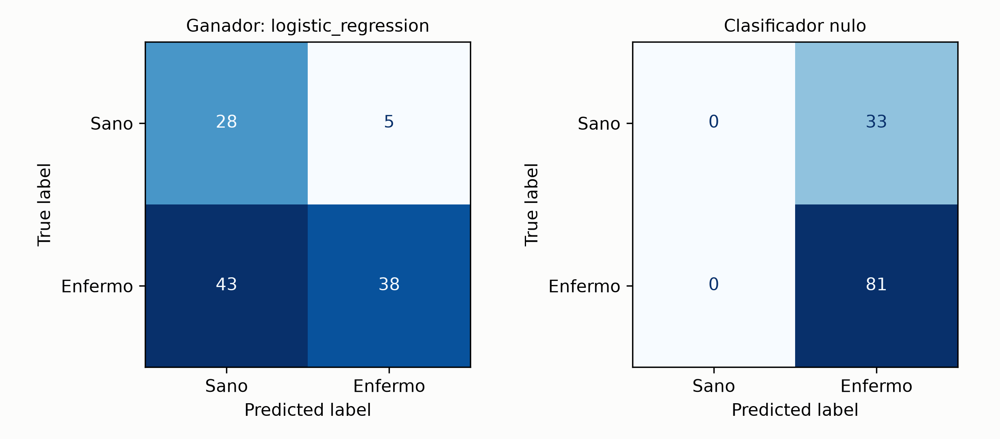
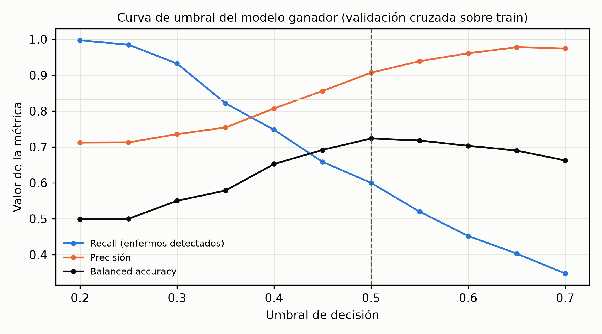
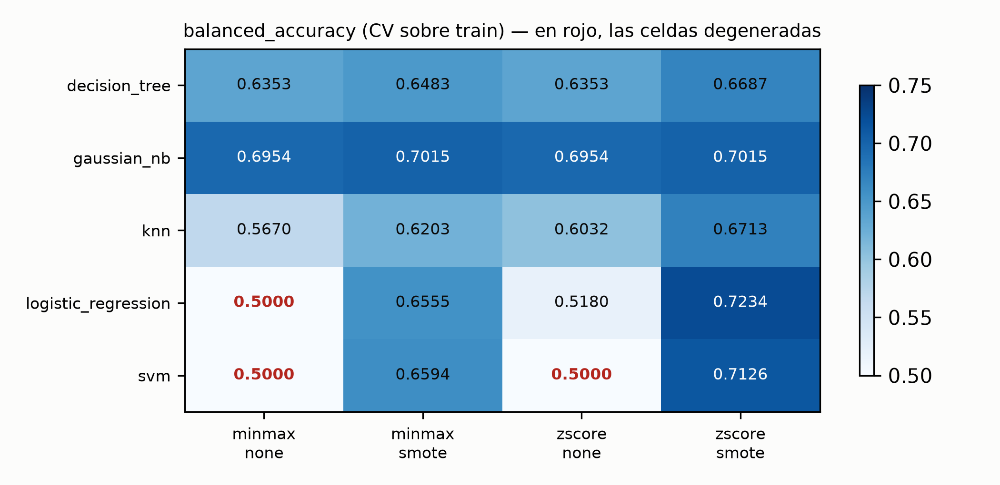
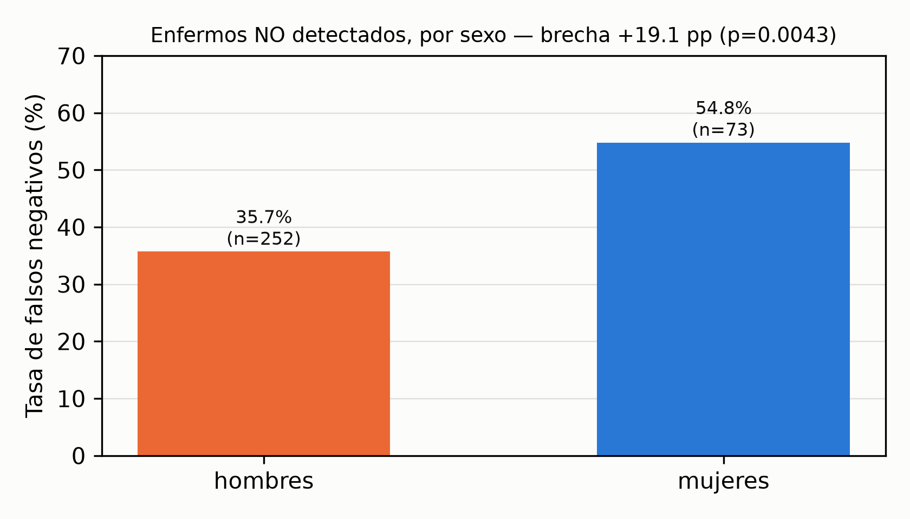

# Modelado y evaluación para la predicción de enfermedades hepáticas

**Actividad 2** · Preparación, entrenamiento y evaluación de cinco algoritmos sobre el *Indian Liver Patient Dataset* (ILPD)

**Repositorio del proyecto:** https://github.com/hatlpm/liver-disease-fairness
*Código ejecutable en `notebooks/act2_anexo.ipynb`; decisiones de ingeniería, tests y fuentes versionados*

---

## 1. Introducción, contexto y alcance

La Actividad 1 auditó el ILPD —583 analíticas de pacientes del noreste de Andhra Pradesh, India— y concluyó que es **adecuado para práctica metodológica pero insuficiente para conclusiones clínicas**: nueve problemas de calidad, ausencia de variables etiológicas y una etiqueta que no es verdad biológica sino el juicio de un especialista. Esta actividad continúa desde ahí: entrena cinco algoritmos sobre esos datos y evalúa qué se puede afirmar con ellos.

### 1.1 Qué se predice, y la trampa que trae incorporada

La variable objetivo es `Selector`: **1 = paciente hepático, 2 = no hepático**. Se recodifica a {1, 0} dejando explícito que **la clase positiva es "enfermo"**. Esa decisión, que parece un tecnicismo, gobierna todo el informe: significa que **la clase positiva es también la mayoritaria** (71.23% del dataset). Un clasificador que respondiera "enfermo" a todos los pacientes, sin mirar un solo análisis de sangre, acertaría el **71%**. Es el suelo contra el que hay que leer cualquier cifra de este documento, y la sección 4 muestra que dos de las cuatro métricas que pide el enunciado están saturadas por él.

`Selector` sigue siendo un ***proxy label***: un modelo entrenado sobre ella no aprende *"quién tiene enfermedad hepática"* sino *"a quién le diagnosticaron enfermedad hepática en ese hospital"*, y hereda los sesgos de ese sistema.

### 1.2 Una precisión sobre el enunciado

Los objetivos de la actividad mencionan explorar *"el consumo de alcohol y el diagnóstico de hepatitis"*. **Esas variables no existen en el ILPD.** El dataset registra nueve marcadores bioquímicos, edad y sexo, y nada más. No se han inventado ni aproximado: es la limitación "ausencia de etiología" que la Actividad 1 ya documentó, y que impide aprender la *causa* del daño hepático, solo su firma bioquímica.

### 1.3 Alcance y regla de trabajo

Se responden las ocho tareas de las Etapas 3 y 4. Se añade, como trabajo propio fuera del enunciado, una **auditoría de equidad por sexo** (sección 6), motivada por que el propio enunciado señala a Straw & Wu (2022) como lectura de referencia.

**Regla que ordena toda la metodología: el conjunto de prueba se congeló al dividir los datos y se tocó una sola vez**, en la sección 4. Ninguna decisión de limpieza, balanceo, selección de variables o ajuste de hiperparámetros lo consultó. **Ningún valor de este informe es estimado**: todos proceden de una celda ejecutada en `notebooks/act2_anexo.ipynb`, y un test automático (`tests/test_fase_e2_informe.py`) verifica que las cifras aquí publicadas coinciden con las que produce el código.

---

## 2. Preparación de los datos (T1, T2, T3)

### 2.1 Limpieza (T1)

> *¿Cómo aseguraste que los datos estuvieran limpios y listos para el modelado?*

Cuatro operaciones deterministas, todas anteriores a la división. El criterio que decide qué puede ir antes de dividir y qué no es uno solo, y conviene enunciarlo primero porque estructura toda la sección:

> **Una operación fila a fila puede ir antes de la división; una estadística calculada sobre el conjunto, no.** Lo primero usa únicamente datos del propio paciente; lo segundo mezcla información de pacientes que después harán de prueba, y eso es *fuga de datos*: infla las métricas sin que nada avise.

**(a) Deduplicación: 583 → 570 filas.** El dataset contiene **13 pares de filas exactamente idénticas** (26 filas). La Actividad 1 decidió conservarlas, y esa decisión era correcta allí: no se entrenaba ningún modelo y no había forma de distinguir entre "dos pacientes distintos con analítica idéntica" y "un error de captura". **Aquí el criterio cambia porque el riesgo cambia.** Si un par idéntico queda repartido entre entrenamiento y prueba, el modelo memoriza la fila y la "acierta" en la evaluación: no es generalización, es memorización, e infla todas las métricas.

No es un riesgo teórico. Con la semilla del proyecto, **5 de los 13 pares caerían a ambos lados de la división**. Se deduplica conservando la primera aparición. Es una **divergencia deliberada respecto de la Actividad 1**, y el coste —13 filas de 583, el 2.2%— es muy inferior al de una métrica sistemáticamente optimista.

**(b) Reconstrucción de `A/G Ratio`: 4 valores faltantes.** El cociente albúmina/globulina no es una medición independiente: se calcula como `ALB / (TP − ALB)`, y **ambos insumos sí están medidos** en las cuatro filas donde falta.

| Fila | Sexo | `TP` | `ALB` | Valor reconstruido |
|---|---|---|---|---|
| 209 | Mujer | 6.6 | 3.9 | **1.44** |
| 241 | Hombre | 6.5 | 3.1 | **0.91** |
| 253 | Mujer | 5.2 | 2.7 | **1.08** |
| 312 | Hombre | 8.5 | 4.8 | **1.30** |

Medido sobre las filas que sí tienen valor, el error absoluto mediano de la fórmula es **0.031**, frente a **0.152** de la imputación por la media: **4.9 veces más precisa**. La Actividad 1 —y el estudio que publicó el dataset— usaron la media.

Con la honestidad que el proyecto se exige: **la fórmula tampoco es exacta.** `TP` y `ALB` vienen redondeadas a un decimal, y dividir cantidades redondeadas amplifica el error relativo. **La correlación entre el valor registrado y el calculado es 0.85, no 1.0.** Es derivada por construcción, pero el redondeo impide recuperarla perfectamente.

**No es fuga**, y por eso puede ir antes de dividir: es aritmética fila a fila, sin ninguna estadística del conjunto.

**(c) Tres filas bioquímicamente imposibles.** La bilirrubina directa es una *fracción* de la total, de modo que `DB ≤ TB` se cumple por definición. Tres filas la violan (índices 246, 261 y 279). No hay evidencia de cuál de los dos valores es el erróneo —corregir uno sería inventar— y eliminar la fila descartaría el resto de la analítica de esos pacientes, que sí es válida. **Se marcan ambos valores como faltantes y las filas se conservan**, elevando los faltantes a 6.

Estos 6 se dejan **sin imputar en esta etapa, a propósito**: la imputación por mediana es una estadística de grupo, y calcularla ahora sería exactamente la fuga que el criterio de arriba prohíbe. Se imputa dentro del pipeline (sección 2.2), con un indicador binario que le dice al modelo qué valores fueron reconstruidos.

**(d) Codificación y limpieza heredada.** `Gender` pasa a {0, 1} y `Selector` a {1 = enfermo, 0 = sano}. Se documenta además que `Age = 90` **no es una edad** sino un tope administrativo de anonimización ("cualquier paciente de más de 89 figura como 90"): hay **un solo paciente** con ese valor.

El dataset de modelado queda en **570 filas × 11 columnas con 6 valores faltantes**, los de las tres filas anteriores. Cero faltantes es requisito técnico: cuatro de los cinco algoritmos no aceptan `NaN`, y usar rutas distintas por modelo rompería la comparabilidad de la tabla de la sección 4.

### 2.2 Balanceo (T2)

> *¿Aplicaste técnicas de balanceo, como SMOTE? Describe el proceso y su impacto.*

Sí, **SMOTE** (*Synthetic Minority Over-sampling Technique*). Genera pacientes sintéticos de la clase minoritaria interpolando entre vecinos cercanos, en lugar de duplicar filas existentes.

**El proceso, y la decisión que importa más que la técnica.** SMOTE va **dentro** de un `imblearn.pipeline.Pipeline`, encadenado como imputación → escalado → selección de variables → SMOTE → estimador. Esto no es un detalle de implementación:

- Aplicado **una sola vez por fuera**, pacientes sintéticos generados a partir de una fila acabarían en el pliegue de validación mientras su fila de origen está en el de entrenamiento. El modelo estaría validándose contra copias interpoladas de lo que ya vio.
- Aplicado **dentro del pipeline**, SMOTE se re-ejecuta en cada pliegue y **solo sobre la porción de entrenamiento de ese pliegue**.

Se usa el `Pipeline` de `imblearn` y no el de `scikit-learn` porque este último no sabe qué hacer con un paso de remuestreo: le pediría a SMOTE que transformara también al predecir, es decir, **aplicaría sobremuestreo al conjunto de prueba**. El de `imblearn` ejecuta los pasos de remuestreo únicamente durante el ajuste.

**El impacto sobre el tamaño.** El entrenamiento pasa de **456 a 650 filas** (325 enfermos / 131 sanos → 325 / 325): **194 pacientes sintéticos**, todos de la clase minoritaria. El conjunto de prueba **sigue en 114 filas** tras ejecutar el pipeline completo y predecir — verificado, no afirmado.

**El impacto sobre quién queda representado.** SMOTE es ciego al sexo, y eso tiene consecuencias medibles. La comparación ingenua —proporción de mujeres en todo el entrenamiento, antes y después— pasa de 24.56% a 24.31% y sugiere que no ocurre nada; pero está **diluida** por las 456 filas reales, que no cambian. La comparación correcta es entre la minoría que SMOTE replica y los sintéticos que genera:

| | Mujeres | Total | % |
|---|---|---|---|
| Minoría de entrenamiento (sanos) | 39 | 131 | **29.77%** |
| Los 194 pacientes sintéticos | 46 | 194 | **23.71%** |
| | | **Brecha** | **−6.06 pp** |

**SMOTE subrepresenta a las mujeres entre los pacientes que inventa**, y no por ninguna decisión explícita: por mecánica propia. Esa brecha se descompone en **dos causas independientes**:

- **Truncamiento a entero (−3.09 pp).** `Gender` es una columna entera, pero SMOTE la *interpola*: **19 de los 194 sintéticos salen con un valor fraccionario** (0.368, 0.165, 0.488…). Al reconstruir la tabla, la librería preserva el tipo original y **trunca hacia 0 —hombre— en lugar de redondear al más cercano**. Redondeando correctamente, los sintéticos serían 26.80% mujeres en vez de 23.71%.
- **Geometría de la interpolación (−2.97 pp).** Es la componente que importa: **aunque el truncamiento se corrigiera, seguiría faltando casi tres puntos de mujeres**. SMOTE elige los `k` vecinos más cercanos por distancia euclídea, y el sexo no participa en ese criterio más que como una dimensión entre otras. Nada garantiza que los vecinos clínicamente más parecidos a una paciente sean mayoritariamente mujeres.

Lo segundo **no es un error de implementación corregible**: es cómo funciona el algoritmo. La sección 6 comprueba si se traduce en peor rendimiento sobre ellas.

**Alternativas descartadas.** El **submuestreo** de la mayoría no inventa nada, pero exigiría descartar 194 de los 325 enfermos reales: con n=456 es un lujo impagable. **`class_weight='balanced'`** no toca los datos —solo repondera la función de pérdida— pero no lo admiten los cinco algoritmos (ni KNN ni Naive Bayes gaussiano lo tienen), y romper la comparabilidad de la tabla comparativa es peor que el problema que resolvería.

### 2.3 División en entrenamiento y prueba (T3)

> *¿Cómo dividiste el conjunto en entrenamiento y prueba? Proporciones.*

División estratificada con `train_test_split`: **456 filas de entrenamiento (80%) y 114 de prueba (20%)**, con semilla fija para que sea reproducible bit a bit.

**Las proporciones se conservan.**

| | Completo | Entrenamiento | Prueba |
|---|---|---|---|
| `Selector = 1` (enfermo) | 0.7123 | 0.7127 | 0.7105 |
| `Gender = 1` (mujer) | 0.2456 | 0.2456 | 0.2456 |

La **desviación máxima es 0.0018** — menos de dos décimas de punto porcentual.

**La estratificación es por la clave compuesta `Selector × Gender`, no solo por la clase.** En un proyecto cuyo eje es la equidad por sexo, dejar la composición del conjunto de prueba al azar significa que el tamaño del subgrupo femenino —del que dependerá cualquier medida de equidad— quede fijado por el muestreo. La diferencia es concreta:

| Estratificación | Mujeres en prueba | Mujeres sanas en prueba |
|---|---|---|
| Solo `Selector` | 33 | **8** |
| `Selector × Gender` (oficial) | 28 | **10** |

**Por qué 0.2, y qué consecuencia tiene.** Es el compromiso habitual entre tener prueba suficiente y no desperdiciar entrenamiento, pero aquí arrastra un límite que conviene declarar antes de que aparezca como sorpresa: con 114 filas de prueba quedan **28 mujeres, de las cuales solo 10 son sanas**. **Es insuficiente para medir equidad** — una sola predicción distinta movería la tasa de falsos negativos femenina unos 10 puntos porcentuales. Por eso la auditoría de la sección 6 **no usa esta división**, sino validación cruzada repetida sobre las 456 filas de entrenamiento.

**Cero fuga, demostrada y no afirmada.** Se construyó una firma de texto por fila y se comprobó que **ninguna se comparte entre entrenamiento y prueba**; los índices son disjuntos. Es el control que atrapa exactamente el problema que motivó deduplicar.

---

## 3. Algoritmos e hiperparámetros (T4, T5)

### 3.1 Los cinco algoritmos y su configuración (T4)

> *¿Qué algoritmos seleccionaste y cómo configuraste cada uno?*

Los **cinco exigidos por el enunciado**, sin sustituciones: regresión logística, KNN, Naive Bayes gaussiano, árbol de decisión y SVM. Los cinco viven dentro del **mismo** pipeline, de modo que la comparación entre ellos es limpia: ninguno recibe un preprocesamiento distinto.

| Algoritmo | Hiperparámetros ajustados | Por qué importan **en este dataset** |
|---|---|---|
| Regresión logística | `C`, `solver` | `C` controla la regularización. Con `A/G Ratio` derivada de `TP` y `ALB` hay colinealidad *por construcción*, y la regularización es lo que impide que los coeficientes se disparen entre variables redundantes |
| KNN | `n_neighbors`, `weights` | Con solo 131 pacientes sanos, un vecindario grande diluye la clase minoritaria; ponderar por distancia lo compensa parcialmente |
| Naive Bayes | `var_smoothing` | Añade varianza artificial a cada variable: es justamente el parche frente a distribuciones muy apuntadas, que es el caso aquí |
| Árbol de decisión | `max_depth`, `min_samples_leaf`, `criterion` | Con 456 filas el sobreajuste es el riesgo dominante: un árbol sin podar memoriza pacientes individuales |
| SVM | `C`, `kernel`, `gamma` | `C` fija cuánto se penaliza cada error y `kernel` decide si la frontera puede ser curva; ambos operan sobre distancias, y por tanto dependen del escalado previo |

**Una limitación declarada, no un error.** `GaussianNB` asume que cada variable, condicionada a la clase, sigue una distribución normal. Medida sobre el dataset de modelado, la asimetría llega a **10.56 en `Sgot` sobre las 570 filas deduplicadas (10.55 en la Actividad 1, sobre las 583 originales)** y a **6.70** en `Sgpt` (0 sería simetría perfecta): **el supuesto se viola abiertamente**. No se sustituye el modelo —es uno de los cinco que el enunciado exige— y que resulte el peor de los cinco es, en sí mismo, evidencia de cuánto cuesta ese incumplimiento.

**Sensibilidad al escalado: la base teórica de la sección 5.** Tres algoritmos son sensibles a la escala y dos no, por mecanismos distintos:

- **Sensibles** — regresión logística (la regularización penaliza según la magnitud de cada coeficiente), KNN (la distancia euclídea queda dominada por la variable de mayor rango) y SVM (el margen y el *kernel* se calculan sobre distancias).
- **Insensibles** — Naive Bayes (estima media y varianza de cada variable por separado) y el árbol (cada partición compara una variable contra un umbral, y **escalar no cambia el orden** de los valores, que es lo único que determina la partición).

**Cuánta redundancia hay que contener.** `A/G Ratio` se calcula como `ALB / (TP − ALB)`: las tres variables están ligadas por una identidad algebraica, no por una relación empírica. El VIF (*variance inflation factor*) mide cuánto se infla la varianza del coeficiente de una variable por su colinealidad con las demás; por encima de 5 suele considerarse señal de alerta. **`ALB` alcanza 8.99 y `TP` 5.08**, ambas por encima del umbral. Lo que **no** confirma la intuición ingenua: **`A/G Ratio` (3.39) no es la variable con mayor VIF del grupo**. Tiene sentido —es un cociente, una relación *no lineal*, y el VIF solo mide colinealidad lineal: no hereda toda la dependencia de sus componentes—. Es la razón concreta por la que `C`, la regularización, es el hiperparámetro que más importa en la regresión logística de este dataset.

**La selección de variables va dentro del pipeline.** Con nueve variables numéricas la selección no es una necesidad de dimensionalidad sino de control de redundancia. Lo decisivo es **dónde** se hace: un selector ajustado sobre el dataset completo antes de la validación cruzada ya vio las etiquetas de las filas que después harán de validación, y produce métricas optimistas —uno de los sesgos mejor documentados de la literatura (Ambroise & McLachlan, 2002). Aquí es un paso más del pipeline, que se reajusta en cada pliegue. **La prueba de que efectivamente se reajusta: los cinco pliegues no eligen el mismo subconjunto de variables.**

**¿Entra `Gender` como variable del modelo?** Es la pregunta central de un proyecto de equidad, así que se ejecutaron **ambas variantes**. Las diferencias en `balanced_accuracy` de validación cruzada van de **−0.0032 a +0.0038**, un rango indistinguible del ruido. Se adopta la variante **sin `Gender`** como oficial. Conviene no leerlo como que el sesgo desaparece: la sección 6 mide que **no desaparece**.

### 3.2 Búsqueda de hiperparámetros (T5)

> *¿Cómo encontraste los mejores hiperparámetros? Grid Search o Random Search.*

**Grid Search** (`GridSearchCV`), no Random Search. Con rejillas de este tamaño la búsqueda exhaustiva es asequible, y ser exhaustiva la hace reproducible sin depender de una semilla de muestreo.

| Algoritmo | Combinaciones de hiperparámetros | × valores de `k` | Total |
|---|---|---|---|
| Regresión logística | 10 | 3 | 30 |
| KNN | 12 | 3 | 36 |
| Naive Bayes | 3 | 3 | 9 |
| Árbol de decisión | 30 | 3 | 90 |
| SVM | 12 | 3 | 36 |
| | | **Total** | **201** |

**Las rejillas viven en `params.yaml`**, no en el cuaderno: dos ejecuciones cualesquiera del proyecto buscan sobre exactamente el mismo espacio. **La validación cruzada es estratificada** (5 pliegues) **y corre solo sobre entrenamiento**; estratificada y no simple porque cada pliegue necesita conservar la proporción 2.49:1 para que SMOTE tenga minoría suficiente con la que trabajar. **El `k` del selector se optimiza dentro de la misma búsqueda**, no por separado: es un hiperparámetro más.

**La decisión de más consecuencia de toda la actividad: qué métrica se maximiza.** Antes de buscar nada hay que fijar el criterio. Como la clase positiva es la mayoritaria, se mide primero qué consigue el clasificador que responde "enfermo" a todo el mundo:

| Métrica | Clasificador nulo (entrenamiento) |
|---|---|
| Accuracy | 0.7127 |
| Recall | 1.0000 |
| Precisión | 0.7127 |
| **F1** | **0.8323** |
| **Balanced accuracy** | **0.5000** |

**Optimizar F1 habría sido un error.** El clasificador que no aprende nada obtiene F1 = 0.8323; ningún modelo honesto que además intente acertar en los sanos va a superarlo, porque acertar en los sanos exige dejar de predecir "enfermo" siempre y eso baja el recall de la clase enferma. Buscar hiperparámetros que maximicen F1 habría seleccionado, sistemáticamente, al modelo más parecido al degenerado. **Se optimiza `balanced_accuracy`**, cuyo suelo es 0.5000 en cualquier reparto de clases. Las cuatro métricas del enunciado se siguen reportando íntegramente: **cambia el criterio de selección, no lo que se informa**.

**Resultado de la búsqueda** (`balanced_accuracy` de validación cruzada, variante oficial):

| Modelo | `balanced_accuracy` (CV) | Mejores hiperparámetros |
|---|---|---|
| **Regresión logística** | **0.7234** | `C`: 0.1 · `solver`: saga · `k`: 10 |
| SVM | 0.7126 | `C`: 1 · `gamma`: scale · `kernel`: linear · `k`: 7 |
| Naive Bayes | 0.7015 | `var_smoothing`: 1e-11 · `k`: 7 |
| KNN | 0.6713 | `n_neighbors`: 5 · `weights`: distance · `k`: 7 |
| Árbol de decisión | 0.6687 | `criterion`: entropy · `max_depth`: 3 · `min_samples_leaf`: 10 · `k`: 10 |

Los cinco superan el suelo de 0.50 por un margen claro. **El ganador queda declarado aquí, antes de tocar el conjunto de prueba.**

---

## 4. Métricas y evaluación comparativa (T6, T7)

### 4.1 Qué métricas y por qué (T6)

> *¿Qué métricas seleccionaste (accuracy, precisión, recall, F1) y por qué?*

Antes de reportar un número hay que fijar qué significa cada error **en pacientes**, porque es lo que decide qué métrica importa:

- **Falso negativo (FN)** — el modelo dice "sano" a un paciente que **sí está enfermo**. Ese paciente **se va a casa sin tratamiento** y la enfermedad sigue avanzando sin que nadie la vigile. En una enfermedad que avanza durante años sin síntomas, es el error caro.
- **Falso positivo (FP)** — el modelo dice "enfermo" a un paciente sano. Genera **una prueba de confirmación de más**, con su coste y su ansiedad, pero es **recuperable**: un estudio de seguimiento lo corrige.

Los costes **no son simétricos**, y en cribado el error caro es el primero. Con eso fijado, cada métrica responde una pregunta distinta:

| Métrica | Qué responde | Por qué no basta **aquí** |
|---|---|---|
| **Accuracy** | ¿qué fracción de todos los pacientes clasifiqué bien? | Con 71% de enfermos, responder "enfermo" a todos da 0.71 sin aprender nada |
| **Precisión** | cuando digo "enfermo", ¿cuántas veces acierto? | Se maximiza siendo extremadamente conservador: diagnosticar solo los casos evidentes |
| **Recall** (sensibilidad) | de todos los enfermos reales, ¿a cuántos detecté? | Se maximiza diciendo "enfermo" a todo el mundo: recall 1.00 y cero valor clínico |
| **F1** | ¿equilibro precisión y recall? | El clasificador degenerado saca 0.83, porque su recall perfecto compensa su precisión mediocre |
| **Balanced accuracy** | ¿acierto en **ambas** clases? | Es la única cuyo suelo (0.50) no depende del desbalance |

Se reportan **las cuatro que pide el enunciado más balanced accuracy**, con `average='binary'` y `pos_label=1` declarados explícitamente porque cambiar ese valor cambiaría todos los números.

**El suelo sobre el conjunto de prueba real** (114 pacientes): accuracy **0.7105** · recall **1.0000** · precisión **0.7105** · F1 **0.8308** · balanced accuracy **0.5000**.

### 4.2 La tabla comparativa (T7)

> *¿Cómo evaluaste el rendimiento de cada modelo? Tabla comparativa.*

Los cinco modelos, con sus hiperparámetros ya fijados por Grid Search sobre entrenamiento, se evaluaron **una sola vez** sobre el conjunto de prueba congelado de 114 pacientes. **La fila del clasificador nulo forma parte de la tabla**: sin ella la comparación no se entiende.

| Modelo | Hiperparámetros y cuadrícula de búsqueda | Hiperparámetros de mejor rendimiento | Métricas de mejor rendimiento | Bal. acc. |
|---|---|---|---|---|
| Regresión logística | `C`: [0.01, 0.1, 1, 10, 100] · `solver`: ['liblinear', 'saga'] | `C`: 0.1 · `solver`: saga · `k`: 10 | Accuracy: 0.5789 · Precisión: 0.8837 · Recall: 0.4691 · F1: 0.6129 | 0.6588 |
| KNN | `n_neighbors`: [3, 5, 7, 9, 11, 15] · `weights`: ['uniform', 'distance'] | `n_neighbors`: 5 · `weights`: distance · `k`: 7 | Accuracy: 0.6316 · Precisión: 0.8197 · Recall: 0.6173 · F1: 0.7042 | 0.6420 |
| Naive Bayes | `var_smoothing`: [1e-11, 1e-09, 1e-07] | `var_smoothing`: 1e-11 · `k`: 7 | Accuracy: 0.5526 · Precisión: 0.9688 · Recall: 0.3827 · F1: 0.5487 | 0.6762 |
| Árbol de decisión | `max_depth`: [3, 5, 7, 10, None] · `min_samples_leaf`: [1, 5, 10] · `criterion`: ['gini', 'entropy'] | `criterion`: entropy · `max_depth`: 3 · `min_samples_leaf`: 10 · `k`: 10 | Accuracy: 0.5789 · Precisión: 0.9231 · Recall: 0.4444 · F1: 0.6000 | 0.6768 |
| SVM | `C`: [0.1, 1, 10] · `kernel`: ['linear', 'rbf'] · `gamma`: ['scale', 'auto'] | `C`: 1 · `gamma`: scale · `kernel`: linear · `k`: 7 | Accuracy: 0.5614 · Precisión: 0.9697 · Recall: 0.3951 · F1: 0.5614 | 0.6824 |
| **Clasificador nulo** ("siempre enfermo") | — | — | Accuracy: 0.7105 · Precisión: 0.7105 · Recall: 1.0000 · F1: 0.8308 | **0.5000** |

**Cómo hay que leer esta tabla.** Los cinco modelos quedan **por debajo del clasificador nulo en accuracy y en F1**. No es una derrota: es la consecuencia aritmética de haber optimizado `balanced_accuracy` en lugar de F1. El nulo "gana" en esas dos métricas **precisamente porque nunca predice "sano"**: tiene recall perfecto sobre los enfermos a costa de no distinguir absolutamente nada. La columna de balanced accuracy es la que separa: los cinco modelos están entre **0.6420 y 0.6824**, y el nulo en **0.5000 exacto**. Los modelos aprendieron algo que el nulo no puede alcanzar por construcción.

### 4.3 Las matrices de confusión, leídas en pacientes

| Modelo | Enfermos detectados (TP) | **Enfermos sin detectar (FN)** | Sanos correctos (TN) | Falsos positivos (FP) | % enfermos sin detectar |
|---|---|---|---|---|---|
| **Regresión logística** | 38 | **43** | 28 | 5 | **53.1%** |
| KNN | 50 | 31 | 22 | 11 | 38.3% |
| Naive Bayes | 31 | 50 | 32 | 1 | 61.7% |
| Árbol de decisión | 36 | 45 | 30 | 3 | 55.6% |
| SVM | 32 | 49 | 32 | 1 | 60.5% |

**Dicho sin suavizar: a umbral 0.5 el modelo ganador deja pasar 43 de los 81 enfermos del conjunto de prueba, el 53%.** Como cribado tal cual, no sirve. Esa frase es el resultado honesto de la evaluación, y la sección siguiente explica por qué eso no equivale a decir que el modelo no discrimine.

### 4.4 El umbral de decisión es la decisión de primer orden

Un clasificador no devuelve "enfermo/sano": devuelve **una probabilidad**, y alguien decide a partir de qué valor se actúa. Ese umbral —fijado por convención en 0.5— es una decisión de producto que determina cuántos enfermos se dejan sin detectar. Se explora **sobre validación cruzada en entrenamiento**, nunca sobre el conjunto de prueba:

| Umbral | Accuracy | Precisión | Recall | F1 | Balanced accuracy |
|---|---|---|---|---|---|
| **0.20** | 0.7105 | 0.7121 | **0.9969** | **0.8308** | **0.4985** |
| 0.30 | 0.7127 | 0.7354 | **0.9323** | 0.8223 | 0.5501 |
| 0.40 | 0.6930 | 0.8073 | 0.7477 | 0.7764 | 0.6525 |
| **0.50** (oficial) | 0.6711 | 0.9070 | 0.6000 | 0.7222 | **0.7237** |
| 0.60 | 0.5965 | 0.9608 | 0.4523 | 0.6151 | 0.7033 |
| 0.70 | 0.5285 | 0.9741 | 0.3477 | 0.5125 | 0.6624 |

**La fila de 0.20 es el argumento más instructivo de todo el informe.** A ese umbral el modelo alcanza F1 = **0.8308**, que es **exactamente el F1 del clasificador nulo**. No es coincidencia: a 0.20 el modelo *reproduce* al clasificador nulo, diciendo "enfermo" a prácticamente todos. Su balanced accuracy cae a 0.4985, **por debajo del azar**. Dicho de otro modo: **en este dataset un F1 de 0.83 solo se alcanza degenerando**, y la tabla de la sección 4.2 debe leerse con eso presente.

En el otro extremo, **a umbral 0.30 el recall sube a 0.9323**: el modelo detectaría el 93% de los enfermos, a costa de bajar la precisión a 0.7354 —más pruebas de confirmación innecesarias—. Ese es el intercambio real que un cribado tendría que decidir.

El umbral **oficial de la tabla comparativa es 0.5**, el valor declarado y comparable entre los cinco modelos, que es lo que el enunciado pide. El punto de 0.30 queda registrado como insumo de discusión explícito, **no adoptado en silencio**.

### 4.5 Cuánta de la diferencia entre modelos es ruido

**El ganador por validación cruzada no es el mejor sobre el conjunto de prueba**: SVM saca 0.6824 de balanced accuracy frente a 0.6588 de la regresión logística. Con n=114, ¿significa algo? Los intervalos de confianza bootstrap dicen que no:

| Modelo | Balanced accuracy | IC 95% |
|---|---|---|
| Regresión logística (ganador por CV) | 0.6588 | [0.5721, 0.7361] |
| SVM (segundo por CV) | 0.6824 | [0.6212, 0.7436] |

**Los intervalos se solapan ampliamente**: la diferencia es ruido de muestreo, no evidencia de que un modelo sea mejor. Cambiar de ganador a la vista de este resultado sería precisamente el error que congelar el conjunto de prueba pretende evitar.

**Una verificación adicional de integridad.** La caída media entre lo que predijo la validación cruzada y lo que ocurrió sobre el conjunto de prueba es de **−2.8 pp** (de −6.5 pp en la regresión logística a +0.8 pp en el árbol). Una brecha de ese tamaño —unos pocos puntos, no veinte o treinta— es la que se espera de un pipeline sin fuga de datos.

---

## 5. Impacto de la normalización y el balanceo (T8)

> *¿Qué impacto tuvo la normalización (MinMax o Z-Score) y el balanceo en las métricas?*

Experimento factorial completo: **{MinMax, Z-Score} × {con SMOTE, sin SMOTE} × 5 modelos = 20 configuraciones**. Dos precauciones de diseño:

- **Las 20 celdas se comparan por validación cruzada sobre entrenamiento, nunca sobre el conjunto de prueba.** Evaluar 20 configuraciones contra la prueba y quedarse con la mejor sería sobreajustarla.
- **Los hiperparámetros se congelan** en los que la sección 3.2 encontró. Reajustarlos dentro de cada celda confundiría el efecto del preprocesamiento con el de volver a ajustar, y la tarea pregunta exactamente por el primero, aislado.

### 5.1 El hallazgo central: tres celdas que no aprendieron nada

Una `balanced_accuracy` de **0.5000 exacto** es sospechosa. Comprobado con las **predicciones reales**, no inferido de la métrica:

| Modelo | Escalador | Balanceo | Predicción | Sanos marcados como enfermos |
|---|---|---|---|---|
| Regresión logística | MinMax | sin SMOTE | siempre "enfermo" | **131 de 131** |
| SVM | MinMax | sin SMOTE | siempre "enfermo" | **131 de 131** |
| SVM | Z-Score | sin SMOTE | siempre "enfermo" | **131 de 131** |

**Sin balanceo, 2 de los 5 algoritmos que el enunciado exige no aprenden absolutamente nada** bajo al menos una combinación de escalador: responden "enfermo" a los 456 pacientes de entrenamiento sin una sola excepción, los 131 sanos incluidos. **Eso, y no una diferencia decimal entre escaladores, es la respuesta a esta tarea.** El balanceo no es un ajuste fino de un par de puntos porcentuales: es la diferencia entre tener un clasificador y no tenerlo.

### 5.2 Cuánto pesa cada factor

| Factor | Nivel | `balanced_accuracy` media | Efecto |
|---|---|---|---|
| **Balanceo** | sin SMOTE → con SMOTE | 0.5850 → 0.6762 | **+0.0913** |
| **Escalado** | MinMax → Z-Score | 0.6183 → 0.6429 | **+0.0247** |

**El balanceo pesa unas cuatro veces más que el escalado.** Y los dos factores **interactúan**: SMOTE aporta +0.0775 bajo MinMax y +0.1051 bajo Z-Score.

### 5.3 Por qué el escalado afecta a unos modelos y no a otros

El mecanismo es el de la sección 3.1: **distancias frente a particiones**. Se verifica midiendo la diferencia entre MinMax y Z-Score celda por celda:

| Modelo | Sin SMOTE | Con SMOTE |
|---|---|---|
| Naive Bayes | 0.000000 | 0.000000 |
| Árbol de decisión | 0.000000 | **0.020427** |
| Regresión logística | 0.018034 | 0.067892 |
| KNN | 0.036154 | 0.050969 |
| SVM | 0.000000 | 0.053219 |

**El resultado más fino del experimento está en la celda marcada.** El árbol de decisión es invariante al escalado sin SMOTE, como predice la teoría — pero **con SMOTE deja de serlo**. No es un error del montaje: **SMOTE elige vecinos por distancia euclídea**, así que bajo MinMax y bajo Z-Score genera pacientes sintéticos **distintos**. El árbol sigue siendo insensible a la escala; lo que no es invariante es el paso que va inmediatamente antes. Un preprocesamiento puede propagar su sensibilidad a la escala hacia un modelo que en sí mismo no la tiene.

**La predicción sobre MinMax se cumple.** La Actividad 1 documentó que MinMax divide por `max − min`, un denominador fijado por **dos pacientes**; con colas largas eso aplasta a la mayoría contra el cero. Medianas escaladas de las cinco variables más asimétricas: `Sgot` 0.0061 · `TB` 0.0067 · `DB` 0.0102 · `Sgpt` 0.0131 · `Alkphos` 0.0738. **Todas en el primer 7.4% del rango.**

### 5.4 Qué hace SMOTE con las métricas

| Balanceo | Recall | Precisión | F1 |
|---|---|---|---|
| Sin SMOTE | 0.7988 | 0.7896 | 0.7643 |
| Con SMOTE | 0.5535 | 0.8819 | 0.6722 |

Leído sin contexto, SMOTE **baja el recall**, que es justo la métrica que más importa en cribado. Pero buena parte de ese recall alto sin SMOTE viene de las celdas degeneradas, que lo consiguen sin distinguir a nadie: **excluyéndolas, el recall sin SMOTE baja de 0.7988 a 0.7125**. El intercambio es real, pero mucho menor de lo que la cifra bruta sugiere, y a cambio la precisión sube de 0.7896 a 0.8819.

**Para un cribado esto no es mala noticia.** Un modelo con sensibilidad perfecta y especificidad cero no criba nada: manda a todos los pacientes, sanos y enfermos, a la misma vía de seguimiento. El valor de un cribado está en reducir el volumen que necesita confirmación **sin dejar pasar enfermos**, y eso exige equilibrar ambos errores. Dicho esto, el recall de 0.55 con SMOTE al umbral 0.5 sigue dejando sin detectar a demasiados enfermos — **el balanceo y el umbral son dos palancas distintas**, y esta tarea solo mueve la primera.

### 5.5 Análisis de sensibilidad

La sección 2.1 decidió conservar e imputar las 3 filas con `DB > TB` en lugar de eliminarlas. Repetido el mejor modelo sin ellas, la `balanced_accuracy` de validación cruzada pasa de 0.7234 a 0.7115: **una diferencia de 0.0119**, pequeña frente a la variación entre pliegues de la propia validación cruzada. **La conclusión no depende de esa decisión.**

---

## 6. Auditoría de equidad por sexo

> Esta sección **no corresponde a ninguna de las ocho tareas**. Se incluye porque el enunciado señala a Straw & Wu (2022) como lectura de referencia, y ese trabajo documenta sesgo por sexo sobre **este mismo dataset**. Medir una brecha y no contrastarla con el único estudio que el enunciado señala sería dejar pasar lo evidente.

**Por qué no se usa la división única.** El conjunto de prueba tiene 28 mujeres, 10 de ellas sanas: una tasa de falsos negativos femenina calculada sobre ~10 personas se movería 10 puntos con una sola predicción distinta. Se usan en cambio predicciones *out-of-fold* de una **validación cruzada estratificada repetida** (5 pliegues × 10 repeticiones) sobre las 456 filas de entrenamiento, que aporta **112 mujeres, 73 de ellas enfermas**.

**La resolución del experimento se declaró antes de ver el resultado**, para no ajustar el listón a lo que saliera: con 73 mujeres enfermas y 252 hombres enfermos, **una brecha menor de ±13.0 pp no sería distinguible del ruido**.

### 6.1 El resultado

| | Mujeres | Hombres |
|---|---|---|
| Enfermas/os | 73 | 252 |
| **Tasa de falsos negativos (FNR)** | **54.8%** | **35.7%** |

**Brecha: +19.08 pp**, con IC 95% bootstrap de **[+5.6, +31.8] pp** —que **excluye el cero**— y **test exacto de Fisher p = 0.0043**.

En términos concretos: **de cada 100 mujeres enfermas de esta muestra, unas 55 se irían a casa sin diagnóstico bajo este modelo, frente a unos 36 de cada 100 hombres enfermos.**

La brecha **supera la resolución declarada de antemano**, así que —a diferencia de la brecha de diagnóstico que la Actividad 1 midió sobre los datos crudos, donde p = 0.055 y el intervalo cruzaba el cero— **esta sí es distinguible del ruido**. El sesgo medido antes de entrenar llega al modelo entrenado.

### 6.2 Dos controles de robustez

1. **No es el artefacto de una partición concreta.** La brecha aparece con el mismo signo en **las 10 repeticiones por separado**, en un rango de **[+17.3, +23.6] pp**.
2. **No la fabrica una decisión de diseño de esta sección.** El modelo auditado tiene 11 variables por efecto de un blindaje técnico del selector, no las 10 que la búsqueda eligió. Repitiendo el análisis con el selector sin blindar —el modelo real de la sección 4— la brecha es **+20.45 pp con p = 0.0027**: de magnitud comparable o mayor. **El blindaje es conservador; no infla el resultado.**

### 6.3 Qué pasa con SMOTE y con `Gender`

| Variante | FNR mujeres | FNR hombres | Brecha | p (Fisher) |
|---|---|---|---|---|
| Sin `Gender`, **con SMOTE** (oficial) | 0.5479 | 0.3571 | **+19.08 pp** | **0.0043** |
| Sin `Gender`, sin SMOTE | 0.0548 | 0.0317 | +2.30 pp | 0.478 |
| Con `Gender`, con SMOTE | 0.5205 | 0.3571 | +16.34 pp | 0.0143 |
| Con `Gender`, sin SMOTE | 0.0548 | 0.0238 | +3.10 pp | 0.240 |

**Las filas "sin SMOTE" tienen brecha pequeña, y eso no es una buena noticia.** Hay que mirar su FNR **absoluta**: cae a ~5% en ambos sexos. No es que el modelo sea equitativo, es que **casi no predice "sano" para nadie** — es la misma degeneración de la sección 5.1, vista desde el otro lado. Un clasificador que no discrimina a nadie tampoco discrimina *entre* grupos, y presentarlo como equidad sería un error de lectura.

**Quitar `Gender` no resuelve el sesgo.** Con la variable, la brecha es +16.34 pp; sin ella, +19.08 pp. Son magnitudes comparables, y en ambos casos significativas. El sesgo **no llega por la columna `Gender`**, sino por variables correlacionadas con el sexo: la Actividad 1 ya documentó que los umbrales de referencia de ALT y los cuartiles de detección de atípicos están calibrados sobre una muestra 75.6% masculina.

### 6.4 Contraste con Straw & Wu (2022)

Straw & Wu auditaron modelos entrenados sobre el ILPD y hallaron tasas de falsos negativos consistentemente peores en mujeres, **hasta −24.07 pp** en regresión logística. Tres precisiones, sin las cuales la comparación se leería mal:

1. **Es corroboración de dirección, no replicación.** Ellos usaron otra metodología; aquí se usó validación cruzada repetida *out-of-fold* sobre entrenamiento, con SMOTE, selector blindado y selección por `balanced_accuracy`. Mismo dataset y misma dirección, **distinto experimento**. No se reproduce su hallazgo: se corrobora su sentido.
2. **Las magnitudes no coinciden.** Ellos reportan hasta −24.07 pp; aquí, +19.08 pp. Los signos difieren por convención —ambos significan "peor para las mujeres"— y **la magnitud medida aquí es menor**. Misma dirección, magnitud algo menor.
3. **El paralelismo que sí vale señalar:** su hallazgo fue en **regresión logística**, que es exactamente el modelo ganador de este trabajo.

### 6.5 Los límites de esta auditoría

**Se hizo sobre entrenamiento, vía validación cruzada, no sobre datos nunca vistos por el proceso de modelado en su conjunto.** Cada predicción individual proviene de un pliegue que no vio esa fila, pero el conjunto de entrenamiento sí participó en el ajuste de hiperparámetros. Es el precio correcto de no gastar el conjunto de prueba dos veces —se gastó una sola vez, en la sección 4— pero **no equivale a una evaluación sobre un conjunto independiente**, y no debe presentarse como tal.

---

## 7. Limitaciones y conclusiones

### 7.1 Limitaciones

**Ausencia de etiología.** No se registran alcohol ni hepatitis viral. Solo puede aprenderse la firma bioquímica del daño, **nunca su causa**. Es también la razón por la que los objetivos del enunciado que mencionan esas variables no pueden abordarse.

**`Selector` es una etiqueta indirecta.** El modelo aprende a reproducir el criterio de quien diagnosticó en un hospital concreto, con sus sesgos. Una variable que "separa bien" puede estar reflejando en qué se fijó el especialista, no qué mide el daño.

**El conjunto de prueba es pequeño.** Con 114 pacientes, los intervalos de confianza tienen varios puntos de ancho: la sección 4.5 muestra dos modelos indistinguibles pese a separarse 2.4 puntos. **Ninguna diferencia de un par de puntos entre modelos debe leerse como una ventaja real.**

**El rendimiento absoluto es bajo para uso clínico.** El mejor modelo alcanza balanced accuracy 0.6588 sobre prueba y, al umbral por defecto, deja pasar el 53% de los enfermos. Discrimina mejor que el azar, pero **no es una herramienta de cribado utilizable tal cual**.

**Limitaciones heredadas de la Actividad 1** que siguen vigentes: `age heaping` (índice de Whipple 163.3) y censura de la edad en 90, que impiden cualquier análisis etario fino; y rangos de referencia procedentes de poblaciones no locales.

**Una divergencia deliberada respecto de la Actividad 1**, declarada: allí se conservaron los 13 duplicados, aquí se eliminan. No es una contradicción sino un cambio de criterio motivado por un cambio de riesgo, documentado en la sección 2.1.

### 7.2 Conclusiones

**Sobre la preparación de los datos.** Las decisiones que más protegen el resultado no son las más visibles: deduplicar antes de dividir (5 de 13 pares habrían quedado repartidos), meter todo el preprocesamiento dentro del pipeline, y distinguir entre operaciones fila a fila y estadísticas de grupo. Ninguna mejora una métrica; todas evitan que las métricas mientan.

**Sobre la elección de la métrica.** Es la decisión de más consecuencia de toda la actividad. Con la clase positiva siendo la mayoritaria, **F1 y accuracy están saturadas por un clasificador que no aprende nada**, y optimizarlas habría premiado sistemáticamente al modelo más degenerado. La prueba más clara está en la curva de umbral: el único punto donde el modelo iguala el F1 del clasificador nulo es aquel en el que **lo reproduce**.

**Sobre el modelado.** El ganador por validación cruzada es la regresión logística (`balanced_accuracy` 0.7234). Los cinco modelos superan el suelo del azar en balanced accuracy y quedan por debajo del nulo en accuracy y F1 — consecuencia esperada y explicada, no una regresión. **Lo que determina si el modelo es utilizable no es el algoritmo sino el punto de operación**: el umbral de 0.30 llevaría el recall a 0.93 a costa de precisión, y esa es la discusión que un despliegue real tendría que tener.

**Sobre el preprocesamiento (T8).** El balanceo pesa unas cuatro veces más que el escalado, pero la cifra promedio esconde lo importante: **sin balanceo, 2 de los 5 algoritmos exigidos colapsan a predecir una sola clase**. Además, el experimento reveló algo no anticipado: **SMOTE propaga su propia sensibilidad a la escala hacia modelos que no la tienen**, porque elige vecinos por distancia euclídea.

**Sobre la equidad.** La brecha de **+19.08 pp** en la tasa de falsos negativos entre mujeres y hombres es **estadísticamente distinguible del ruido** (IC 95% [+5.6, +31.8], p = 0.0043), supera la resolución declarada de antemano y sobrevive a dos controles de robustez. Va en **la misma dirección que Straw & Wu, con magnitud algo menor**. Y **quitar `Gender` del modelo no la resuelve**: el sesgo llega por variables correlacionadas.

**Lo que este trabajo aporta más allá del enunciado.** La Actividad 1 concluyó que un pipeline de datos aparentemente neutro puede introducir sesgo por sexo **antes de entrenar modelo alguno**. Esta actividad cierra el argumento midiendo el otro extremo: **ese sesgo no se queda en los datos — llega al modelo entrenado, y llega en magnitud medible y significativa.** Un modelo puede ser correcto en cada paso de su construcción y aun así repartir sus errores de forma desigual entre subgrupos; solo desagregando las métricas se ve.

---

## Referencias

- Straw, I. & Wu, H. (2022). *Investigating for bias in healthcare algorithms: a sex-stratified analysis of supervised machine learning models in liver disease prediction*. BMJ Health Care Inform, 29(1). DOI 10.1136/bmjhci-2021-100457
- Chawla, N. V., Bowyer, K. W., Hall, L. O. & Kegelmeyer, W. P. (2002). *SMOTE: Synthetic Minority Over-sampling Technique*. Journal of Artificial Intelligence Research, 16, 321–357. DOI 10.1613/jair.953
- Ambroise, C. & McLachlan, G. J. (2002). *Selection bias in gene extraction on the basis of microarray gene-expression data*. PNAS, 99(10), 6562–6566. DOI 10.1073/pnas.102162699
- Prati, D. et al. (2002). *Updated definitions of healthy ranges for serum alanine aminotransferase levels*. Annals of Internal Medicine, 137(1). DOI 10.7326/0003-4819-137-1-200207020-00006
- Ramana, B. V. & Venkateswarlu, N. B. *ILPD (Indian Liver Patient Dataset)*. UCI Machine Learning Repository. DOI 10.24432/C5D02C
- Pedregosa, F. et al. (2011). *Scikit-learn: Machine Learning in Python*. JMLR, 12, 2825–2830.
- Lemaître, G., Nogueira, F. & Aridas, C. K. (2017). *Imbalanced-learn: A Python Toolbox to Tackle the Curse of Imbalanced Datasets in Machine Learning*. JMLR, 18(17), 1–5.

---

## Material complementario

Por el límite de extensión, este informe presenta los resultados y su interpretación, no el desarrollo completo. El repositorio contiene el trabajo íntegro, reproducible de principio a fin:

### https://github.com/hatlpm/liver-disease-fairness

| Qué contiene | Por qué puede interesar |
|---|---|
| `notebooks/act2_anexo.ipynb` | **El código de las ocho tareas en orden literal T1→T8**, ejecutado y con salidas, más la auditoría de equidad |
| `notebooks/04_split.ipynb` … `09_fairness.ipynb` | El desarrollo completo por fases, con los análisis que no cupieron aquí |
| `src/` | La lógica del proyecto, importable y testeada: el mismo código que se evalúa es el que se desplegaría |
| `tests/` | Verificación automática, incluida la de que **las cifras de este informe coinciden con las que produce el código** |
| `docs/adr/` | Las decisiones de ingeniería razonadas, con las alternativas descartadas |
| `docs/CHANGELOG_iteraciones.md` | Los *loops* CRISP-DM, con fecha, disparador y decisión |

Todos los cuadernos pasan *restart & run all* sin errores. El historial de *commits* documenta el proceso fase por fase, incluidas las correcciones metodológicas: qué se dio por válido, qué se refutó y qué conclusiones hubo que atenuar.
